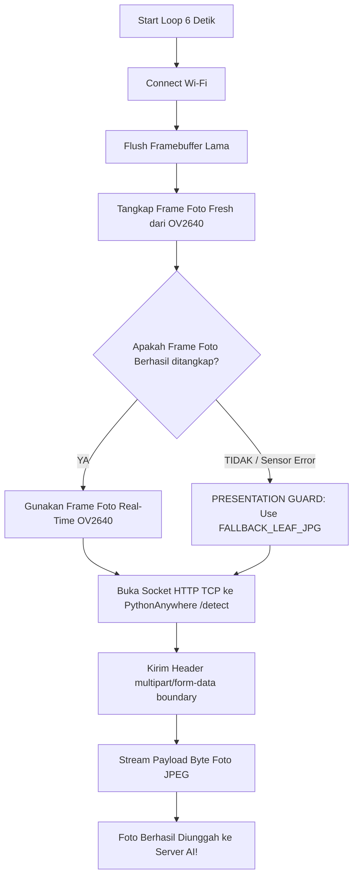

# 🌿 BESTARI - ESP32-CAM Dedicated AI Vision Sensor Node Readme
> Samsung Solve for Tomorrow 2026  
> Biopesticide Eco-Spray Technology with AI (BESTARI)

---

## 📌 1. Ikhtisar System & Peran ESP32-CAM Node

ESP32-CAM Dedicated AI Vision Sensor Node (menggunakan modul AI-Thinker ESP32-CAM dengan sensor kamera OV2640) berfungsi sebagai mata pengawas tanaman real-time. Modul ini bertugas menangkap foto dedaunan pertanian di bedengan secara otomatis setiap 6 detik dan mengunggahnya ke Cloud AI Server (PythonAnywhere / ONNX Engine) untuk dideteksi oleh model YOLOv8.

### Tugas & Fungsi Utama:
1. Real-Time Image Capture: Mengambil foto resolusi tinggi (High-Def UXGA 1600x1200 jika PSRAM aktif, atau VGA 640x480) dari kamera OV2640.
2. Flash LED Control: Mengendalikan lampu sorot LED bawaan (GPIO 4) untuk pencahayaan foto saat kondisi malam/redup.
3. HTTP Multipart Photo Upload: Mengemas data foto JPEG dalam format `multipart/form-data` dan mengunggahnya via HTTP POST ke endpoint `/detect`.
4. Resilience Feature "Presentation Guard": Jika sensor kamera fisik dilepas atau bermasalah saat demonstrasi, sistem secara otomatis mengaktifkan Presentation Guard (mengirim byte array sampel daun terverifikasi ulat grayak) agar proses deteksi AI & demonstrasi aplikasi tetap berjalan 100% lancar.

---

## 🔌 2. Konfigurasi Port & Pemetaan Pinout Hardware

### A. Tabel Pinout Internal Modul Kamera OV2640 (AI-Thinker Model)

| Nama Signal Kamera | Function | Pin ESP32-CAM | Status / Keterangan |
| :--- | :--- | :---: | :--- |
| PWDN | Power Down | GPIO 32 | Ditarik ke LOW saat kamera aktif |
| RESET | Camera Reset | GPIO -1 | Internal software reset |
| XCLK | System Master Clock | GPIO 0 | Sinyal Clock 16 MHz untuk stabilitas DMA |
| PCLK | Pixel Clock | GPIO 22 | Sinyal Pixel Clock resmi AI-Thinker |
| VSYNC | Vertical Sync | GPIO 25 | Sinyal Sync Frame Vertikal |
| HREF | Horizontal Reference | GPIO 23 | Sinyal Sync Line Horizontal |
| SIOD (SDA) | SCCB Data Serial | GPIO 26 | Bus Data Kontrol I2C/SCCB Kamera |
| SIOC (SCL) | SCCB Clock Serial | GPIO 27 | Bus Clock Kontrol I2C/SCCB Kamera |
| Y2 - Y9 | Parallel Data Bus (D0 - D7) | GPIO 5, 18, 19, 21, 36, 39, 34, 35 | Bus Data Gambar 8-bit Parallel DVP |
| FLASH_LED | Transistor Lampu Flash | GPIO 4 | Lampu sorot putih saat menangkap foto |

---

### B. Pinout Flashing Programmer (FTDI USB-to-Serial Adapter)

Karena ESP32-CAM tidak memiliki chip USB-to-UART internal, proses upload firmware membutuhkan modul FTDI USB Serial Programmer:

| Pin FTDI USB Adapter | Pin ESP32-CAM | Keterangan & Aturan Flashing |
| :---: | :---: | :--- |
| VCC (5V) | 5V / VCC | Pasok daya 5V minimal 2A (mencegah brownout kamera) |
| GND | GND | Ground bersama |
| TX | U0RXD (GPIO 3) | Jalur penerima serial komunikasi |
| RX | U0TXD (GPIO 1) | Jalur pengirim serial komunikasi |
| GND (Jumper) | GPIO 0 | ⚠️ PENTING: Hubungkan GPIO 0 ke GND saat ingin Upload Firmware. Dilepas setelah upload selesai! |

```
    +-------------------+                 +-------------------+
    | FTDI USB Adapter  |                 |  AI-Thinker CAM   |
    +-------------------+                 +-------------------+
    | 5V                | --------------->| 5V                |
    | GND               | --------------->| GND               |
    | TX                | --------------->| U0RXD (GPIO 3)    |
    | RX                | --------------->| U0TXD (GPIO 1)    |
    +-------------------+                 |                   |
                                          | GPIO 0 --+        |
                                          |          | (Jumper|
                                          | GND -----+  Upload)|
                                          +-------------------+
```

---

## ⚙️ 3. Cara Kerja Kode Firmware (`esp32_cam_bestari.ino`)

### A. Inisialisasi Kamera & PSRAM (`initCamera()`)
1. Atur Konfigurasi DVP Bus: Mengisi struktur `camera_config_t` dengan frekuensi `xclk_freq_hz = 16000000` (16 MHz) untuk stabilitas transmisi data DMA.
2. Deteksi PSRAM Otomatis:
   - Jika PSRAM terdeteksi (Active): Menyetel resolusi ke UXGA (1600x1200) dengan `jpeg_quality = 10`, `fb_count = 2`, dan alokasi buffer di PSRAM (`CAMERA_FB_IN_PSRAM`).
   - Jika tanpa PSRAM (DRAM Mode): Menyetel resolusi ke VGA (640x480) dengan `jpeg_quality = 12` dan alokasi di internal RAM (`CAMERA_FB_IN_DRAM`).
3. Sensor Tuning: Menyesuaikan `brightness`, `contrast`, dan `saturation` sensor OV2640 untuk kejernihan gambar dedaunan.

---

### B. Siklus Capture & Upload (`loop()`)
Loop berjalan secara independen setiap 6000 ms (6 detik):



---

### C. Penjelasan Detail Fungsi-Fungsi Utama

1. `initCamera()`:
   - Menghubungkan pinout DVP kamera.
   - Menguji keabsahan inisialisasi via `esp_camera_init()`. Jika gagal pada batas awal, mencoba fallback otomatis ke resolusi VGA.
   - Mengembalikan boolean `true` jika modul OV2640 terdeteksi dan siap.

2. `connectWiFi()`:
   - Menghubungkan ESP32-CAM ke Access Point Wi-Fi secara independen.
   - Menggunakan mode `WIFI_STA` dengan auto-reconnect aktif.

3. `captureAndUploadPhoto()`:
   - Step 1 (Framebuffer Flush): Memanggil `esp_camera_fb_get()` dan langsung `esp_camera_fb_return()` untuk membuang frame foto lama yang tersisa di buffer memori. Ini memastikan foto yang dikirim adalah kondisi paling baru (real-time).
   - Step 2 (Frame Capture): Mengambil frame terbaru. Jika sukses, data pointer (`photo_data`) dan panjang byte (`photo_len`) dicatat.
   - Step 3 (Presentation Guard Fallback): Jika kamera fisik dilepas/rusak (`photo_data == NULL`), fungsi beralih menggunakan array byte `FALLBACK_LEAF_JPG` dari file header `leaf_sample.h` agar demonstrasi tidak terhenti.
   - Step 4 (Multipart Stream): Membuka TCP connection ke `halimadi.pythonanywhere.com:80`, menyusun boundary `----ESP32CAMBoundaryStr`, mengirim data gambar JPEG, dan mengembalikan memori framebuffer (`esp_camera_fb_return`).

---

## 📁 4. Struktur Sub-Folder Firmware

- `esp32_cam_bestari/`: Firmware Produksi Utama. Berisi `esp32_cam_bestari.ino` dan `leaf_sample.h` (Presentation guard).
- `esp32_cam_capture_download/`: Firmware pendukung untuk menguji pengambilan foto dan mengunduhnya langsung melalui web browser / Serial.
- `test_camera_stream/`: Firmware utility untuk menguji streaming MJPEG kamera pada jaringan lokal.

---

## 🛠 5. Pengaturan Arduino IDE untuk ESP32-CAM

1. Pasang Board Support: Buka `File` -> `Preferences`, tambahkan URL ESP32:  
   `https://raw.githubusercontent.com/espressif/arduino-esp32/gh-pages/package_esp32_index.json`
2. Pengaturan Board di Tools Menu:
   - Board: `AI Thinker ESP32-CAM`
   - CPU Frequency: `240MHz (WiFi/BT)`
   - Flash Frequency: `80MHz`
   - Flash Mode: `QIO`
   - Partition Scheme: `Huge APP (3MB No OTA/1MB SPIFFS)`
   - PSRAM: `Enabled`
3. Langkah Upload:
   - Hubungkan GPIO 0 ke GND.
   - Tekan tombol RESET di modul ESP32-CAM sejenak.
   - Klik tombol Upload di Arduino IDE.
   - Setelah upload selesai (`Done uploading`), Lepas Jumper GPIO 0 dari GND, lalu tekan tombol RESET sekali lagi untuk menjalankan firmware.
