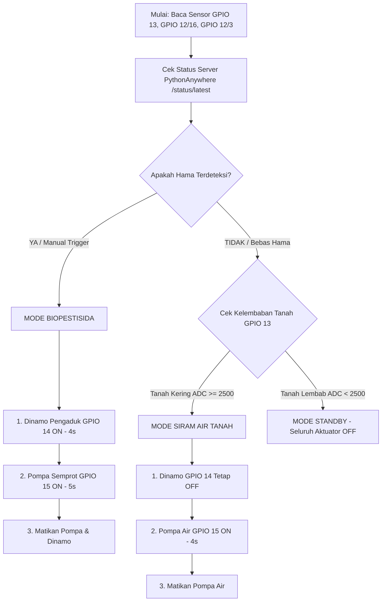

# 🌿 BESTARI - Panduan Firmware ESP32-CAM Main Board
**Samsung Solve for Tomorrow 2026**

Firmware ini dikonfigurasi khusus untuk **ESP32-CAM (AI-Thinker OV2640 Module)** yang difungsikan sebagai **Main Controller Board** sekaligus **Kamera AI Deteksi Hama**.

---

## 📌 Pemetaan Pinout Hardware Terbaru (Pin Fisik Header AI-Thinker)

| Komponen Hardware | Pin Komponen | Pin ESP32-CAM | Deskripsi Aksi / Status Pin |
| :--- | :--- | :---: | :--- |
| **Dinamo Pengaduk** | Relay IN1 | **GPIO 14** | **(TETAP)** Mengaduk larutan biopestisida |
| **Pompa Semprot / Air** | Relay IN2 | **GPIO 15** | **(TETAP)** Menyemprot biopestisida / menyiram tanah |
| **Sensor Ultrasonik 1 & 2** | Combined TRIG | **GPIO 12** | **(TETAP)** Sinyal triger bersama untuk HC-SR04 1 & 2 |
| **Ultrasonik 1 (Tangki Biopestisida)** | ECHO | **GPIO 16** | **(DIUBAH)** Level biopestisida (Pin Header IO16 / U2RXD) |
| **Ultrasonik 2 (Tangki Air Bersih)** | ECHO | **GPIO 3** | **(DIUBAH)** Level air bersih (Pin Header IO3 / U0RXD) |
| **Sensor Kelembaban Tanah** | Analog Out (A0) | **GPIO 13** | **(TETAP)** Analog Read (ADC2_CH4 dengan trik Wi-Fi Pause) |
| **Modul Kamera AI (OV2640)** | PCLK / Hardware | **GPIO 2** | **(TETAP)** Pixel clock internal OV2640 camera |
| **Flash LED (Lampu Kilat)** | Flash Transistor | **GPIO 4** | **(TETAP)** Lampu kilat pencahayaan sampel daun |

---

## ⚠️ Catatan PENTING Pengaturan IDE Arduino & Hardware

1. **Pengaturan Arduino IDE:**
   - **Board**: `AI Thinker ESP32-CAM`
   - **PSRAM**: `Disabled` *(Wajib Disabled karena GPIO 16 digunakan untuk ECHO Sensor Ultrasonik 1)*.
   - **Partition Scheme**: `Huge APP (3MB No OTA/1MB SPIFFS)`

2. **Keamanan Tegangan ECHO Ultrasonik:**
   - Sensor HC-SR04 bekerja pada 5V dan mengeluarkan sinyal ECHO 5V.
   - Sangat disarankan memasang **Voltage Divider** (resistor 1kΩ & 2kΩ) pada pin ECHO (GPIO 16 & GPIO 3) agar menurunkan sinyal dari 5V ke 3.3V demi keamanan pin ESP32-CAM.

3. **Solusi ADC2 (GPIO 13) saat Wi-Fi Aktif:**
   - GPIO 13 adalah pin Analog (ADC2_CH4). Firmware secara otomatis menjeda driver Wi-Fi (`esp_wifi_stop()`) selama beberapa milidetik saat membaca ADC2, lalu menyalakannya kembali (`esp_wifi_start()`) sehingga nilai ADC tidak bernilai 0 / 4095.

---

## 🧪 Diagram Alur Keputusan Otomatis

