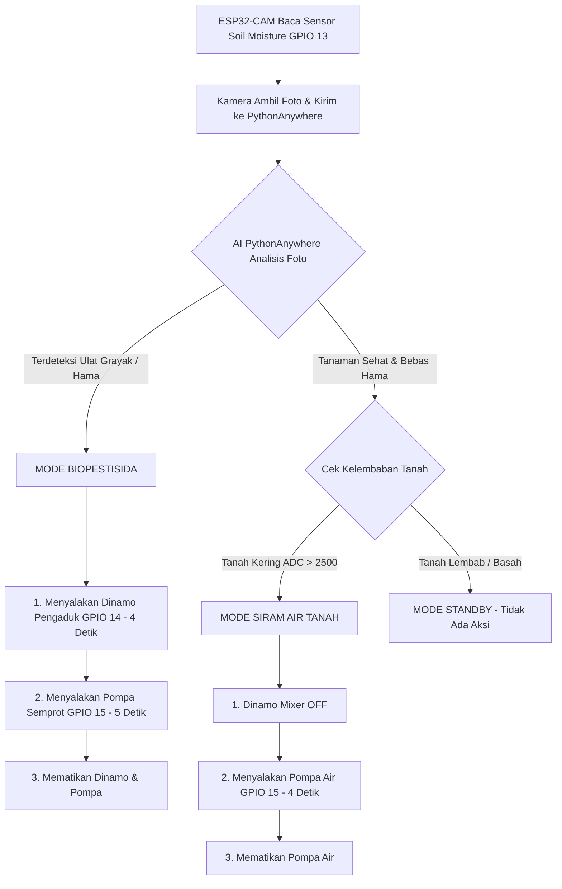

# 🌿 BESTARI - Panduan Firmware ESP32-CAM (AI Pest Monitoring & Dual-Spraying System)
**Samsung Solve for Tomorrow 2026**

Firmware ini bertugas untuk:
1. **Membaca Sensor Kelembaban Tanah (Soil Moisture)** dari pin **IO13 / GPIO 13**.
2. **Mengambil foto tanaman** jagung/pertanian secara otomatis dari kamera OV2640.
3. **Mengirim foto via HTTPS POST** ke Server Flask AI di **PythonAnywhere** (`https://<username>.pythonanywhere.com/detect`).
4. **Menerima dan membaca hasil analisis AI** (`threat_detected`, `ulat_grayak_count`, `relay_action`).
5. **Mengontrol Aktuator 2-Channel Relay secara Cerdas**:
   - **Mode Biopestisida** (Hama Terdeteksi): Menyalakan **Dinamo Pengaduk (Relay IN1 - GPIO 14)** selama 4 detik, lalu **Pompa Semprot (Relay IN2 - GPIO 15)** selama 5 detik untuk menyemprot larutan biopestisida.
   - **Mode Siram Air** (Tanah Kering & Bebas Hama): Menyalakan **Pompa Air (Relay IN2 - GPIO 15)** selama 4 detik untuk menyiram tanah dengan air netral (Dinamo Pengaduk tetap MATI).
   - **Mode Standby** (Tanah Lembab & Bebas Hama): Seluruh relai tetap MATI.

---

## 📌 Skema Wiring & Port Hardware Lengkap

### 1. Solar Panel & System Power Supply (TP4056 + Step-Up):
* **Panel Surya**:
  * (-) Negatif -> `IN-` TP4056
  * (+) Positif -> `IN+` TP4056
* **TP4056 Charge Module**:
  * `B+` -> Battery (+)
  * `B-` -> Battery (-)
  * `OUT+` -> Step-Up `IN+`, COM Relay Channel 1, COM Relay Channel 2
  * `OUT-` -> Step-Up `IN-`
* **Step-Up Boost Converter**:
  * `OUT+` (5V) -> Pin `5V` ESP32-CAM, Pin `VCC` Relay Module
  * `OUT-` (GND) -> Pin `GND` ESP32-CAM, Pompa (-), GND Relay, Dinamo (-), GND Sensor

### 2. Modul Relay 2-Channel (Active LOW):
| Komponen Aktuator | Pin Relay | Pin ESP32-CAM | Keterangan Fungsi |
| :--- | :--- | :---: | :--- |
| **Dinamo Pengaduk Biopestisida (+)** | NO Channel 1 | **GPIO 14 (IN1)** | Mengaduk racikan biopestisida agar homogen |
| **Pompa Semprot Air/Pestisida (+)** | NO Channel 2 | **GPIO 15 (IN2)** | Menyemprot biopestisida ke daun / siram air ke tanah |

### 3. Sensor Kelembaban Tanah (Soil Moisture):
| Pin Sensor | Pin ESP32-CAM | Keterangan |
| :--- | :---: | :--- |
| **VCC** | **3V3** | Daya sensor 3.3V |
| **A0 (Analog Output)** | **GPIO 13 (IO13)** | Pembacaan analog kelembaban tanah (0 - 4095 ADC) |

---

## ⚙️ Persiapan Arduino IDE

1. **Board Settings**:
   * Board: `AI Thinker ESP32-CAM`
   * CPU Frequency: `240MHz (WiFi/BT)`
   * Flash Frequency: `80MHz`
   * Partition Scheme: `Huge APP (3MB No OTA/1MB SPIFFS)`
   * PSRAM: `Enabled` (jika menggunakan modul dengan PSRAM)

2. **Library Yang Dibutuhkan**:
   * **`ArduinoJson`** (v6.x atau v7.x)
   * **`WiFiClientSecure`** (Sudah bawaan ESP32 Board Core)

---

## 🚀 Pengaturan URL PythonAnywhere

Buka file **[`esp32_cam_bestari.ino`](file:///c:/Majid's/SFT'26/bestari/esp32_cam/esp32_cam_bestari.ino)** dan ubah variabel berikut sesuai jaringan & akun PythonAnywhere Anda:

```cpp
const char* WIFI_SSID     = "NAMA_WIFI_ANDA";
const char* WIFI_PASSWORD = "PASSWORD_WIFI_ANDA";

// URL Flask server Anda di PythonAnywhere
const char* PYTHONANYWHERE_URL = "https://username.pythonanywhere.com/detect";
```

---

## 🧪 Diagram Alur Logika Keputusan (Decision Tree)


