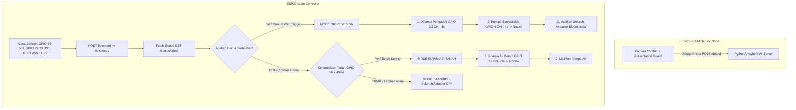

# 🌿 BESTARI - Panduan Firmware Dual-ESP32 Architecture
Samsung Solve for Tomorrow 2026

Sistem hardware BESTARI menggunakan Arsitektur Dual Microcontroller (Dual-ESP32) untuk pemisahan tugas yang optimal, resiliensi memori, dan keamanan pinout IO:

1. ESP32 Main Controller Board (DevKit 30-Pin): Berfungsi sebagai pusat kontrol utama, pemrosesan sensor (Kelembaban tanah & Level tangki), penggerak aktuator (Dinamo mixer, Pompa biopestisida, Pompa air bersih), dan komunikasi telemetri Cloud.
2. ESP32-CAM Sensor Node (AI-Thinker OV2640 Module): Berfungsi khusus sebagai modul sensor pengambil foto sampel daun real-time dan pengunggah data visual ke server AI (`/detect`).

---

## 📌 1. Pemetaan Pinout ESP32 Main Controller (DevKit 30-Pin)

| Komponen Hardware | Pin Komponen | Pin ESP32 DevKit | Deskripsi Aksi / Status Pin |
| :--- | :--- | :---: | :--- |
| Dinamo Pengaduk Biopestisida | Relay 1 IN1 | GPIO 23 | Mengaduk racikan biopestisida di tangki sebelum penyemprotan |
| Pompa Semprot Biopestisida | Relay 2 IN2 | GPIO 4 | Mengalirkan biopestisida via selang biopestisida ke 1 Dual-Input Nozzle |
| Pompa Siram Air Bersih | Relay 3 IN3 | GPIO 19 | Mengalirkan air bersih via selang air ke 1 Dual-Input Nozzle |
| Ultrasonik 1 (Tangki Biopest) | TRIG / ECHO | TRIG: GPIO 27 ECHO: GPIO 33 | Sensor ketinggian level cairan tangki biopestisida (HC-SR04) |
| Ultrasonik 2 (Tangki Air) | TRIG / ECHO | TRIG: GPIO 25 ECHO: GPIO 26 | Sensor ketinggian level cairan tangki air bersih (HC-SR04) |
| Sensor Kelembaban Tanah | Analog Out (A0) | GPIO 34 | Reading Analog Kelembaban (ADC1_CH6 - Aman dipakai bersama Wi-Fi) |
| Nozzle Semprot & Siram | Output Muara | (Muara 2 Selang) | Single Nozzle yang menerima aliran biopestisida & air |

---

## 📌 2. Pemetaan Pinout ESP32-CAM (AI-Thinker Camera Node)

| Komponen Hardware | Pin Module | Pin ESP32-CAM | Deskripsi / Status |
| :--- | :--- | :---: | :--- |
| Modul Kamera AI (OV2640) | Parallel DVP | GPIO 5, 18, 19, 21, 36, 39, 34, 35, 25, 23, 2, 0, 26, 27, 32 | Bus data & kontrol kamera real-time |
| Flash LED (Lampu Kilat) | Transistor Flash | GPIO 4 | Pencahayaan foto sampel daun saat gelap |

---

## ⚠️ Catatan PENTING Pengaturan IDE Arduino

1. Main Controller Board (ESP32 DevKit):
   - Board: `ESP32 Dev Module`
   - Upload Speed: `921600`
   - Partition Scheme: `Default 4MB with spiffs`

2. Camera Sensor Node (ESP32-CAM):
   - Board: `AI Thinker ESP32-CAM`
   - PSRAM: `Enabled` (Dapat diaktifkan 100% karena pin GPIO 16/17 tidak bentrok dengan sensor ultrasonik).
   - Partition Scheme: `Huge APP (3MB No OTA/1MB SPIFFS)`

---

## 🧪 Diagram Alur Keputusan Otomatis Sistem Dual-ESP32

