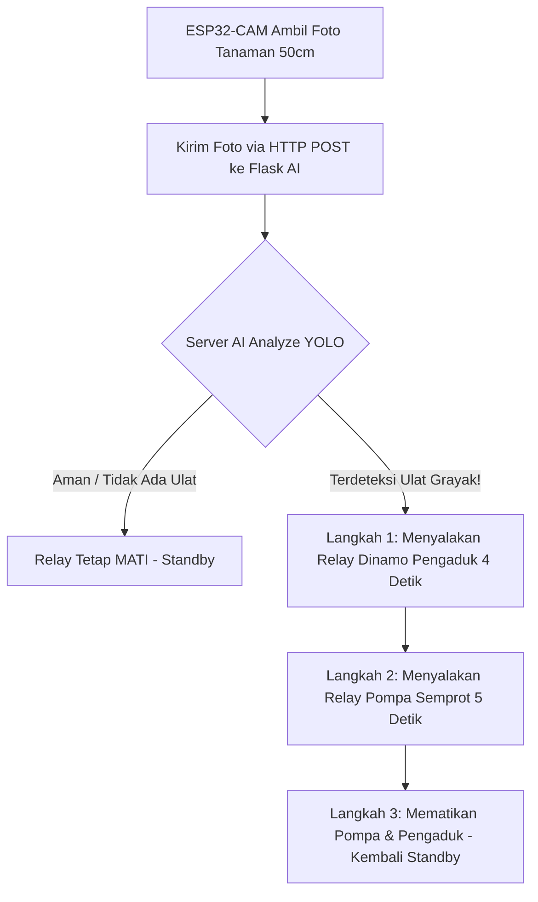

# 🌿 BESTARI - Panduan Firmware ESP32-CAM (AI Pest Monitoring & Spraying System)
Projek **Samsung Solve for Tomorrow 2026**

Firmware ini bertugas untuk:
1. **Mengambil foto tanaman** jagung/pertanian dari jarak **50 cm** secara berkala (misal tiap 30 detik).
2. **Mengirim foto** via HTTP Multipart POST ke Backend Flask AI YOLO (`server_yolo.py`).
3. **Menerima dan membaca hasil deteksi JSON** dari AI (`threat_detected`, `ulat_grayak_count`, `relay_action`).
4. **Mengaktifkan Aktuator Otomatis**:
   - Menyalakan **Dinamo Pengaduk Biopestisida** (Mixer Motor) agar larutan biopestisida tercampur rata.
   - Menyalakan **Pompa Semprot** (Mini Water Spray Pump) untuk menyemprot tanaman yang terserang ulat grayak.

---

## 📌 Skema Wiring & Pinout ESP32-CAM (AI-Thinker)

| Komponen Hardware | Pin ESP32-CAM | Jenis Pin | Keterangan |
| :--- | :---: | :---: | :--- |
| **Relay 1 (Dinamo Pengaduk / Mixer)** | **GPIO 14** | Output | Menyalakan motor pengaduk biopestisida |
| **Relay 2 (Pompa Semprot / Spray Pump)** | **GPIO 13** | Output | Menyalakan pompa sprayer biopestisida |
| **Flash LED Camera** | **GPIO 4** | Output | Cahaya kilat jika kondisi tanaman redup |
| **Power Supply VCC** | **5V** | Power | Hubungkan ke Catu Daya / Adaptor 5V 2A |
| **GND** | **GND** | Ground | Ground bersama (ESP32 + Relay) |

---

## ⚙️ Persiapan & Modul Library Arduino IDE

1. **Board Manager**:
   * Buka Arduino IDE -> `Tools` -> `Board` -> `esp32` -> **`AI Thinker ESP32-CAM`**.
   * Jika belum ada, tambahkan URL Board Manager ESP32: `https://raw.githubusercontent.com/espressif/arduino-esp32/gh-pages/package_esp32_index.json`

2. **Library yang Dibutuhkan**:
   * **`ArduinoJson`** (Versi 6.x atau 7.x)
     * Install via: `Tools` -> `Manage Libraries` -> Cari `ArduinoJson` -> Install.

---

## 🚀 Langkah Upload & Pengujian

1. Buka file **[`esp32_cam_bestari.ino`](file:///c:/Majid's/SFT'26/bestari/esp32_cam/esp32_cam_bestari.ino)** di Arduino IDE.
2. Sesuaikan **Wi-Fi** dan **IP Laptop/Server**:
   ```cpp
   const char* WIFI_SSID     = "Nama_WiFi_Anda";
   const char* WIFI_PASSWORD = "Password_WiFi_Anda";

   // IP Laptop yang menjalankan python server_yolo.py (port 5000)
   const char* SERVER_URL    = "http://192.168.1.50:5000/detect";
   ```
3. Hubungkan ESP32-CAM ke FTDI Programmer (GPIO 0 disambungkan ke GND saat upload).
4. Klik **Upload** di Arduino IDE.
5. Setelah upload selesai, cabut kabel GPIO 0 dari GND, tekan tombol **RESET** di ESP32-CAM, lalu buka **Serial Monitor** pada kecepatan `115200 baud`.

---

## 🧪 Alur Kerja Sekuensial Pengaduk & Pompa


