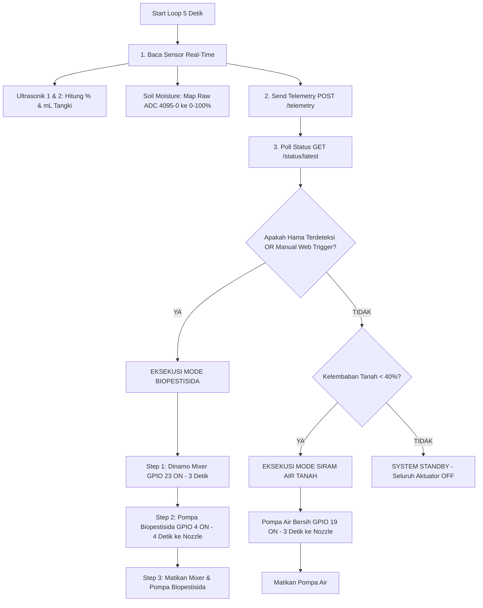

# 🌿 BESTARI - ESP32 Main Controller Readme
> Samsung Solve for Tomorrow 2026  
> Biopesticide Eco-Spray Technology with AI (BESTARI)

---

## 📌 1. Ikhtisar System & Peran Main Controller

ESP32 Main Controller Board (menggunakan modul ESP32 DevKit v1 30-Pin) berfungsi sebagai pusat pengendali utama (IoT Gateway & Actuator Controller) dalam ekosistem BESTARI. Board ini bekerja secara independen namun tersinkronisasi dengan Cloud AI Server.

### Tugas & Fungsi Utama:
1. Pembacaan Sensor Telemetri Real-Time:
   - 2x Sensor Ultrasonik (HC-SR04) untuk mengukur level persentase (%) dan volume cairan (mL) pada Tangki Biopestisida dan Tangki Air Bersih.
   - 1x Sensor Kelembaban Tanah (Soil Moisture ADC1) untuk memantau kondisi tanah bedengan pertanian.
2. Pengendalian Aktuator Terintegrasi (3-Relay Active-LOW):
   - Dinamo Pengaduk (Mixer): Mengaduk formula biopestisida Beauveria bassiana di dalam tangki agar tidak mengendap sebelum disemprotkan.
   - Pompa Biopestisida: Mengalirkan cairan biopestisida ke 1 Dual-Input Spray Nozzle.
   - Pompa Air Bersih: Mengalirkan air bersih untuk penyiraman tanah otomatis ke 1 Dual-Input Spray Nozzle.
3. Komunikasi Cloud AI (IoT Gateway):
   - Mengirim data telemetri sensor secara berkala ke endpoint `/telemetry`.
   - Melakukan polling respon AI Server ke endpoint `/status/latest` untuk mengeksekusi penyemprotan otomatis saat hama terdeteksi.

---

## 🔌 2. Konfigurasi Port & Pemetaan Pinout Hardware

### A. Tabel Pinout ESP32 DevKit (30-Pin)

| Komponen Hardware | Pin Komponen | Pin ESP32 DevKit | Mode Pin | Logika / Status Operasional |
| :--- | :--- | :---: | :---: | :--- |
| Relay 1 (Dinamo Pengaduk / Mixer) | IN1 | GPIO 23 | `OUTPUT` | Active-LOW (`LOW` = ON / Aduk, `HIGH` = OFF) |
| Relay 2 (Pompa Biopestisida) | IN2 | GPIO 4 | `OUTPUT` | Active-LOW (`LOW` = ON / Semprot ke Nozzle, `HIGH` = OFF) |
| Relay 3 (Pompa Air Bersih) | IN3 | GPIO 19 | `OUTPUT` | Active-LOW (`LOW` = ON / Siram ke Nozzle, `HIGH` = OFF) |
| Ultrasonik 1 (Tangki Biopestisida) | TRIG<br>ECHO | GPIO 27<br>GPIO 33 | `OUTPUT`<br>`INPUT` | Pulsa Trigger 10µs<br>Echo Timeout 25ms (ADC/Digital Input) |
| Ultrasonik 2 (Tangki Air Bersih) | TRIG<br>ECHO | GPIO 25<br>GPIO 26 | `OUTPUT`<br>`INPUT` | Pulsa Trigger 10µs<br>Echo Timeout 25ms (ADC/Digital Input) |
| Sensor Kelembaban Tanah | Analog (A0 / SIG) | GPIO 34 | `INPUT` | ADC1_CH6 (Aman digunakan bersamaan dengan Wi-Fi) |
| Power Supply Sensor & Potensio | VCC / GND | 3.3V / GND | POWER | Daya 3.3V untuk Sensor Kelembaban / Potensio |
| Power Supply Relay & Ultrasonik | VCC / GND | 5V / GND | POWER | Daya 5V VCC untuk Modul Relay & HC-SR04 |

> ⚠️ Catatan Pemilihan Pin GPIO 34 (Soil Moisture):  
> ESP32 memiliki dua modul ADC (ADC1 dan ADC2). Pin ADC2 tidak dapat digunakan ketika Wi-Fi aktif. Oleh karena itu, sensor kelembaban tanah dipetakan ke GPIO 34 (ADC1_CH6) agar pembacaan analog tetap 100% akurat saat koneksi internet/Wi-Fi terhubung.

---

### B. Diagram Wiring Wokwi Simulation (`diagram.json`)

```
               +----------------------------------+
               |     ESP32 DevKit v1 (30-Pin)     |
               +----------------------------------+
                 |    |    |    |    |    |    |
   GPIO 23 ------+    |    |    |    |    |    +------ GPIO 34 (Soil Moisture Pot)
   GPIO 4  -----------+    |    |    |    +----------- GPIO 26 (Ultrasonic 2 ECHO)
   GPIO 19 ----------------+    |    +---------------- GPIO 25 (Ultrasonic 2 TRIG)
   GPIO 33 ---------------------+    +---------------- GPIO 27 (Ultrasonic 1 TRIG)
                                     +---------------- GPIO 33 (Ultrasonic 1 ECHO)

  [GPIO 23] ---> Relay 1 IN ---> Dinamo Pengaduk (Gold LED)
  [GPIO 4]  ---> Relay 2 IN ---> Pompa Biopestisida (Blue LED)  ---> [Dual-Input Nozzle]
  [GPIO 19] ---> Relay 3 IN ---> Pompa Air Bersih (Cyan LED)    ---> [Dual-Input Nozzle]
```

---

## ⚙️ 3. Cara Kerja Kode Firmware (`esp32_main_controller.ino`)

### A. Alur Inisialisasi Sistem (`setup()`)
1. Disable Brownout Detector: `WRITE_PERI_REG(RTC_CNTL_BROWN_OUT_REG, 0)` dijalankan untuk mencegah reboot mendadak akibat fluktuasi tegangan saat relay berdaya tinggi menyala.
2. Inisialisasi Aktuator (Relay Security): Seluruh pin relay diset ke state `HIGH` (`RELAY_OFF`) sebelum dikonfigurasi sebagai `OUTPUT`. Ini mencegah pompa atau dinamo menyala menyemprot secara tidak sengaja saat proses booting.
3. Inisialisasi Sensor: Pin ultrasonik diset sebagai `OUTPUT` (Trig) & `INPUT` (Echo). Sensor kelembaban tanah dikonfigurasi dengan `analogSetPinAttenuation(SOIL_MOISTURE_PIN, ADC_11db)` untuk membaca rentang tegangan penuh 0V - 3.3V.
4. Koneksi Wi-Fi: Memanggil `connectWiFi()` untuk terhubung ke jaringan Wi-Fi local/hotspot.

---

### B. Siklus Eksekusi Utama (`loop()`)
Loop berjalan secara non-blocking menggunakan pengukur waktu `millis()` dengan interval polling 5000 ms (5 detik):



---

### C. Penjelasan Detail Fungsi-Fungsi Utama

1. `readUltrasonicDistance(trigPin, echoPin)`:
   - Memancarkan pulsa ultrasonik 10 microsecond.
   - Mengukur waktu pantulan balik (`pulseIn`) dengan timeout 25 ms.
   - Menghitung jarak dalam cm (`duration x 0.0343 / 2.0`).
   - Hasil dikonversi menjadi persentase level cairan (`(TANK_HEIGHT - distance) / TANK_HEIGHT x 100`) dan volume mL.

2. `getSoilMoisturePercent()`:
   - Membaca nilai analog raw 12-bit (0 hingga 4095).
   - Melakukan pemetaan inversi (`map(rawValue, 4095, 0, 0, 100)`): Nila 4095 menandakan tanah kering (0%), sedangkan 0 menandakan tanah basah sempurna (100%).

3. `sendTelemetryToServer(...)`:
   - Membuka koneksi HTTP POST ke server cloud (`/telemetry`).
   - Mengirimkan JSON payload berisi `soil_moisture_percent`, `biopesticide_level_percent`, `biopesticide_vol_ml`, `water_level_percent`, dan `water_vol_ml`.

4. `fetchServerStatus(...)`:
   - Membuka koneksi HTTP GET ke server cloud (`/status/latest`).
   - Menerima keputusan AI Server: apakah ada hama terdeteksi (`pest_detected` / `threat_detected`), jumlah ulat (`ulat_grayak_count`), durasi kustom penyemprotan (`spray_duration_sec`), atau pemicuan manual dari aplikasi web (`relay_active`).

5. `executeBioPesticideSpraying(customDurationMs)`:
   - Tahap 1: Dinamo Pengaduk (GPIO 23) menyala selama 3000 ms untuk mengaduk larutan biopestisida.
   - Tahap 2: Pompa Biopestisida (GPIO 4) menyala selama 4000 ms (atau sesuai settingan web) untuk mengalirkan biopestisida ke spray nozzle.
   - Tahap 3: Seluruh aktuator biopestisida dimatikan kembali secara aman.

6. `executeWaterIrrigation()`:
   - Memastikan mixer biopestisida mati.
   - Menyutikan air bersih via Pompa Air (GPIO 19) selama 3000 ms ke spray nozzle untuk menjaga kelembaban tanah ideal.

---

## 🛠 4. Panduan Compiling & Flashing Firmware

### Menggunakan PlatformIO / VS Code:
1. Buka folder `esp32_main_controller` di VS Code dengan ekstensi PlatformIO.
2. File konfigurasi `platformio.ini`:
   ```ini
   [env:esp32dev]
   platform = espressif32
   board = esp32dev
   framework = arduino
   monitor_speed = 115200
   lib_deps =
       bblanchon/ArduinoJson @ ^7.0.4
   ```
3. Hubungkan ESP32 DevKit ke USB PC, lalu klik tombol Upload (panah kanan di toolbar PlatformIO).

### Menggunakan Arduino IDE:
1. Buka file `esp32_main_controller.ino`.
2. Pilih Board: `Tools` -> `Board` -> `ESP32 Arduino` -> `ESP32 Dev Module`.
3. Pasang Library: Buka `Library Manager` (Ctrl+Shift+I), cari `ArduinoJson` dan install versi 6.x atau 7.x.
4. Pilih Port COM yang sesuai dan klik Upload.
